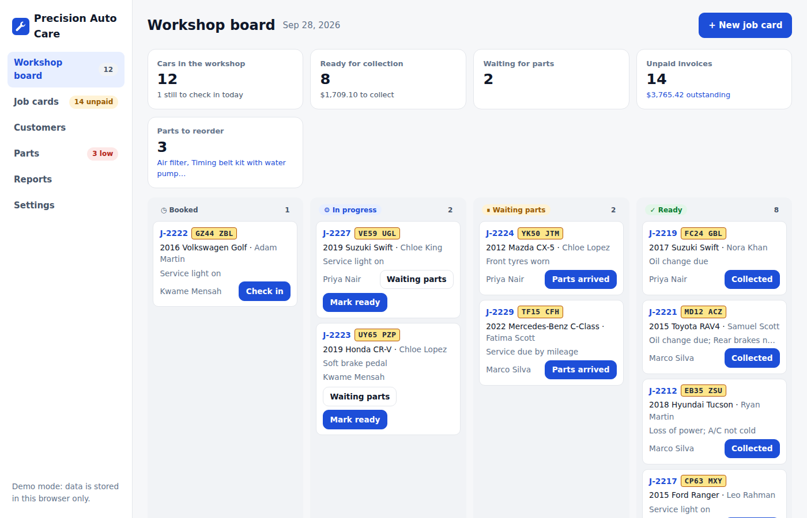
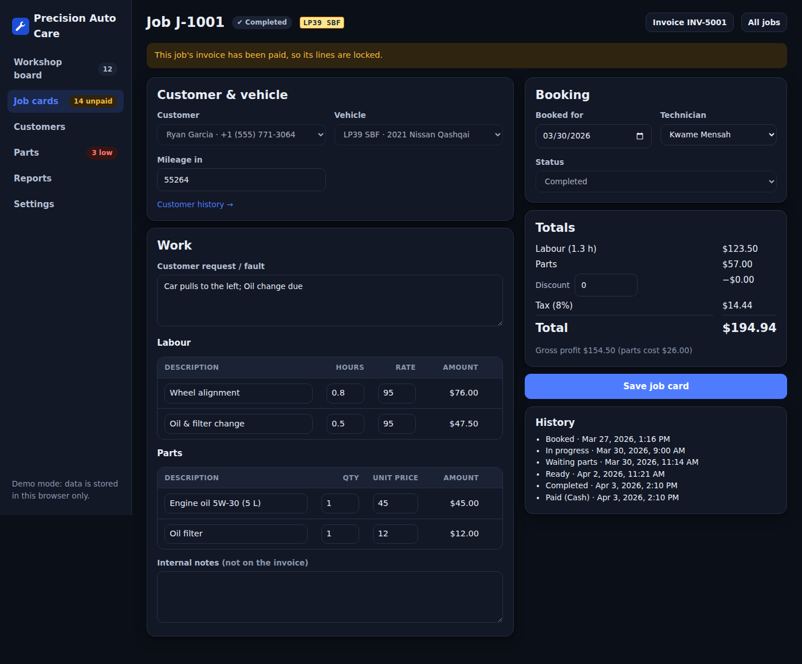
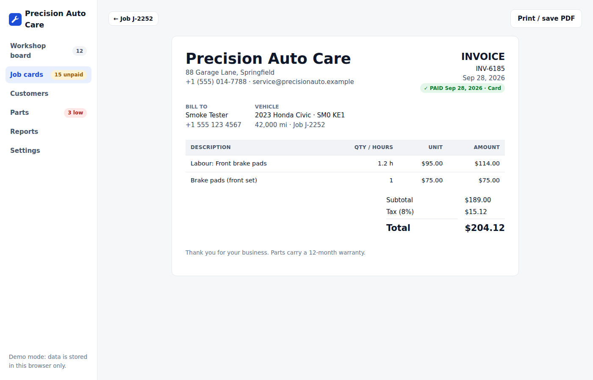
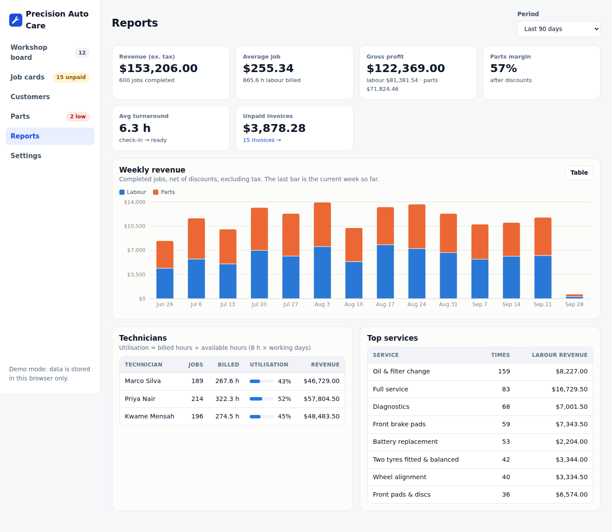

# Workshop Manager for garages and auto repair shops

A complete front-office app for a small or medium workshop, built around the features garages ask for when they hire developers: job cards, technicians, parts stock, invoicing and service reminders.



| Job card | Invoice | Reports |
|---|---|---|
|  |  |  |

## Features

- **Workshop board.** Today's cars by stage (Booked → In progress → Waiting parts → Ready), with one-click moves (Check in, Mark ready, Parts arrived, Collected). Also: overdue bookings, the next 7 days of bookings, and KPIs for cars in the shop, cash waiting at collection, unpaid invoices and parts to reorder.
- **Job cards.**
  - Pick an existing customer and vehicle, or add both on the spot.
  - Labour lines (hours × rate) and part lines, with **one-click service packages** such as "Front brake pads" (labour plus the right parts).
  - Live totals with discount and tax, gross profit, full status history, and technician assignment.
- **Parts that track stock automatically.** Adding a part to a job takes it off the shelf, editing the quantity adjusts it, and cancelling the job puts it back. The editor warns when you're using more than you have. There's also a receive-stock form, reorder levels, duplicate-SKU protection and stock value at cost.
- **Invoices.** Issued automatically when a job is completed, printable or savable as PDF from the browser, with mark-as-paid (cash, card, bank transfer). Paid jobs are locked so the books can't drift.
- **Customers.** Search by name, phone or plate, with each customer's vehicles and full service history. A **Service due** list shows cars whose last service was more than N months ago and that aren't already booked, ready for reminder calls.
- **Reports.** Revenue split into labour and parts per week, average job value, gross profit, parts margin, average turnaround, unpaid invoices, technician utilisation (billed ÷ available hours) and top services. Every chart has a table view.
- **Settings.** Workshop details on the invoice, currency and locale (e.g. `PKR`/`en-PK`, `AED`/`en-AE`), tax %, labour rate, service interval, technicians, and backup, restore and reset.

## Correctness notes

- Money is stored in **whole cents**, so totals never pick up floating-point errors. Tax is rounded once, on the net amount.
- Discounts can't exceed the job subtotal, so totals never go negative.
- Stock changes are calculated as the difference between a job's old and new parts. Saving a job twice never double-counts, and cancelled jobs hold no stock.

## Run it

```bash
npm install
npm run dev      # http://localhost:5173
npm test         # unit tests (money, stock, dates, analytics, demo-data consistency)
npm run build
npm run smoke    # browser test of the real workflows on desktop, phone and dark mode (after build)
```

The app starts with 6 months of realistic demo data (about 160 customers, 1,200 jobs, 3 technicians and 24 stock items). **Settings → Reset demo** regenerates it up to today.

## Deploy
This repo is private, and GitHub Pages for private repos needs a paid GitHub plan, so the Pages workflow runs **only when started by hand**. To publish:
1. Make the repo public (or upgrade your plan).
2. Settings → Pages → Source: **GitHub Actions**.
3. Actions → **Deploy…** → Run workflow.

Or deploy anywhere static for free (Netlify, Vercel, Cloudflare Pages): build it and upload the output folder.

## Before using it with real customers

This is a demo build: data lives in one browser, and there are no user accounts. For a paying workshop, add:

1. A database and API (e.g. Supabase or Postgres). The shapes in `src/types.ts` map directly to tables, and all business rules are pure functions in `src/lib`.
2. Logins with roles (advisor, technician, owner).
3. SMS or WhatsApp notifications ("your car is ready", service reminders).
4. Optional integrations: parts suppliers' catalogues, accounting (QuickBooks or Xero), online booking from the garage's website.
